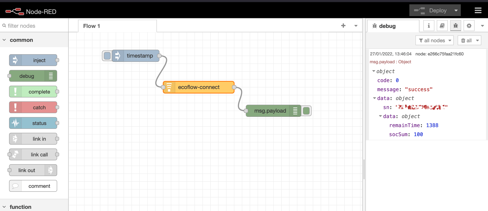

# node-red-contrib-ecoflow
node red extension for ecoflow api

In credentials settings, you must provide : 
- serial number
- app key
- secret key

You should ask ecoflow's support for these informations

Exemple of returned data :

{
  "statusCode": 200,
  "payload": {
    "code": "0",
    "message": "Success",
    "data": {
      "soc": 93,
      "remainTime": 8949,
      "wattsOutSum": 5,
      "wattsInSum": 0
    }
  },
  "error": ""
}
